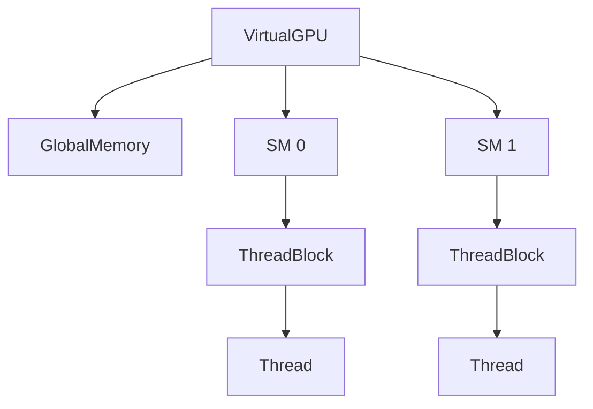

# Py Virtual GPU

Simulador em Python de uma arquitetura de GPU para estudos de paralelismo e programacao de kernels. O projeto reproduz de forma conceitual os principais elementos de uma GPU moderna, permitindo experimentar o modelo SIMT sem hardware dedicado.

## Componentes Principais

- **VirtualGPU** – dispositivo que agrega vários `StreamingMultiprocessor`s e a `GlobalMemory`.
- **StreamingMultiprocessor** – executa `ThreadBlock`s e gerencia `Warp`s.
- **ThreadBlock** – conjunto de threads com `SharedMemory` e barreira de sincronização.
- **Thread/Warp** – threads são agrupadas em warps que executam em *lock-step*.
- **Memórias** – `GlobalMemory` compartilhada por todos os blocks, `SharedMemory` restrita a cada block e `LocalMemory` privada por thread para variáveis grandes e spill de registradores.

Um resumo detalhado das classes está em [docs/class_structure.md](docs/class_structure.md). Para uma descrição do fluxo de execução consulte [docs/components_and_execution.md](docs/components_and_execution.md).

## Visão Geral da Arquitetura



O `VirtualGPU` distribui blocks para os SMs, que por sua vez instanciam warps e threads para executar o kernel.

## Hierarquia de Memória

Registradores, `SharedMemory`, `LocalMemory`, `ConstantMemory` e `GlobalMemory` são modelados com latências conceituais. Dados constantes podem ser carregados com `gpu.set_constant`:

```python
gpu.set_constant(b"valores")
```


## Funcionalidades

- API de gerenciamento de memoria (`malloc`, `free`).
- Copias entre host e dispositivo por `memcpy_host_to_device` e `memcpy_device_to_host`.
- Decorador `@kernel` que permite executar funcoes Python como kernels.
- Lançamento de kernel via `launch_kernel` com exposicao de `threadIdx` e `blockIdx`.
- Memoria constante (`64 KiB` por padrao) acessivel por
  `gpu = VirtualGPU.get_current(); gpu.read_constant(...)` ou `thread.const_mem.read(...)`.
- `Thread.alloc_local(size)` permite reservar bytes em `LocalMemory` para variáveis locais grandes do kernel.
- Ponteiros retornados por `malloc` são objetos `DevicePointer` e agora aceitam
  aritmética e indexação (`ptr + n`, `ptr[i]`, etc.), imitando a sintaxe do
  CUDA C++.
- Funcoes `atomicAdd`, `atomicSub`, `atomicCAS`, `atomicMax`, `atomicMin` e `atomicExchange` realizam operacoes atomicas sobre `DevicePointer`. Os mesmos metodos continuam disponiveis em `SharedMemory` e `GlobalMemory`.
### Operacoes Atomicas

```python
from py_virtual_gpu import kernel, atomicAdd

@kernel(grid_dim=(1, 1, 1), block_dim=(4, 1, 1))
def incr(threadIdx, blockIdx, blockDim, gridDim, counter_ptr):
    atomicAdd(counter_ptr, 1)
```

## Exemplo rapido


```python
from py_virtual_gpu import VirtualGPU, kernel

gpu = VirtualGPU(num_sms=1, global_mem_size=64)
VirtualGPU.set_current(gpu)

@kernel(grid_dim=(1, 1, 1), block_dim=(2, 1, 1))
def hello(threadIdx, blockIdx, blockDim, gridDim, msg):
    print(threadIdx, blockIdx, msg)

hello("Oi")

ptr = gpu.malloc(8)
ptr[0] = b"abcd"
ptr[1] = b"efgh"
print(ptr[0], ptr[1])
gpu.free(ptr)

# Leitura de memoria constante
gpu.set_constant(b"abc")
print(gpu.read_constant(0, 3))
```

## API

Para iniciar a API execute:

```bash
pip install -e .[api]
make dev-api
```


A documentação Swagger estará disponível em http://localhost:8000/docs.
Por padrão a aplicação inicializa duas GPUs com quatro SMs cada.

## Running the Examples

Example programs are located in [`examples/`](examples). They can be executed
directly and optionally started with the API so that the dashboard UI reflects
their progress.

```bash
# plain execution
python examples/vector_mul.py
python examples/matrix_mul.py
python examples/reduction_sum.py
python examples/reduction_sum_multi.py

# start with API support to visualize in the UI
python examples/vector_mul.py --api
python examples/matrix_mul.py --api
python examples/reduction_sum.py --api
python examples/reduction_sum_multi.py --api
```

When ``--api`` is used the script launches the FastAPI server in the background
and registers the created GPU with the global manager. You can then run the UI
from the `app` directory to inspect the execution:

```bash
cd app && npm install && npm run dev
```
Node.js and npm must be installed for the dashboard to run. The helper
``start_background_dashboard`` will raise an error if ``npm`` is not found on
your ``PATH``. On Windows the helper automatically launches ``npm.cmd`` via
``cmd.exe`` so the dashboard works the same way as on Unix systems. The helper
also sets ``VITE_API_BASE_URL`` so the React app talks to the API port you
specified and chooses a free UI port if necessary.

The dashboard makes periodic requests to `/gpus` to list available devices,
`/gpus/<id>/state` for detailed metrics, `/gpus/<id>/kernel_log` for the kernel launch history and `/events` for the consolidated event feed. If you
want to confirm the API is responding during an example run you can query these
endpoints manually using `curl`:

```bash
curl http://localhost:8000/gpus
curl http://localhost:8000/gpus/0/state
curl http://localhost:8000/gpus/0/kernel_log
curl http://localhost:8000/events
```

In the dashboard, navigate to a GPU detail page and use the **Show Kernel Log**
button to toggle a table listing all recorded kernel launches.

## Using with Jupyter/REPL

To expose the API while working interactively start it in a background thread:

```python
from py_virtual_gpu.api.server import start_background_api, start_background_dashboard

api_thread, ui_proc, stop = start_background_dashboard(port=8001)
# ... interact with the API/UI ...
stop()
```
This is helpful when running notebooks or experimenting in the Python REPL. The
``start_background_dashboard`` helper launches both the FastAPI server and the
React dashboard with a single call. If you only need the API server use
``start_background_api`` instead.

## Setup de desenvolvimento

Antes de executar a suíte de testes, instale o pacote com as dependências opcionais definidas em `[project.optional-dependencies]` do `pyproject.toml`:

```bash
pip install -e .[api]
```

Em seguida instale os pacotes de desenvolvimento listados em `requirements.txt`:

```bash
pip install -r requirements.txt
```

Por fim, rode a suíte de testes:

```bash
pytest
```

## Contribuindo

Consulte [CONTRIBUTING.md](CONTRIBUTING.md) para mais detalhes de como contribuir.


