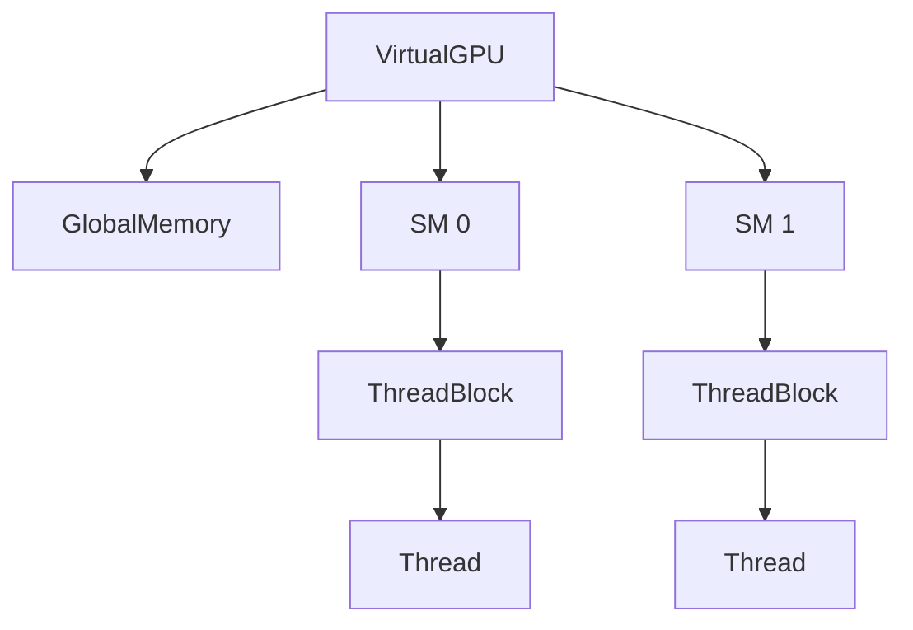

# Py Virtual GPU

This project is a **Python-based GPU simulator** for exploring parallelism and kernel programming. It reproduces the key building blocks of a modern GPU so that the SIMT model can be studied without specialized hardware.

## Core Components

- **VirtualGPU** – device that groups several `StreamingMultiprocessor` instances and the `GlobalMemory`.
- **StreamingMultiprocessor** – executes `ThreadBlock` objects and manages `Warp`s.
- **ThreadBlock** – a set of threads with its own `SharedMemory` and a synchronization barrier.
- **Thread/Warp** – threads are grouped into warps that run in lock-step.
- **Memories** – `GlobalMemory` shared by all blocks, per-block `SharedMemory` and per-thread `LocalMemory` for large variables and register spill.

See [docs/class_structure.md](docs/class_structure.md) for a class overview and [docs/components_and_execution.md](docs/components_and_execution.md) for execution details.

## Architecture Overview



The `VirtualGPU` distributes blocks to the SMs which in turn spawn warps and threads to run a kernel.

## Memory Hierarchy

Registers, `SharedMemory`, `LocalMemory`, `ConstantMemory` and `GlobalMemory` are modeled with conceptual latency. Constant values can be loaded with `gpu.set_constant`:

```python
gpu.set_constant(b"values")
```

## Features

- Memory management API (`malloc`, `free`).
- Host/device copies via `memcpy_host_to_device` and `memcpy_device_to_host`.
- `@kernel` decorator to run Python functions as kernels.
- Kernel launch through `launch_kernel` exposing `threadIdx` and `blockIdx`.
- Constant memory (`64 KiB` by default) available via `gpu = VirtualGPU.get_current(); gpu.read_constant(...)` or `thread.const_mem.read(...)`.
- `Thread.alloc_local(size)` reserves bytes in `LocalMemory` for large kernel variables.
- Pointers returned by `malloc` are `DevicePointer` objects that support arithmetic and indexing (`ptr + n`, `ptr[i]`, etc.) similar to CUDA C++.
- Passing a `dtype` like `Half`, `Float32` or `Float64` to `malloc` (or using `malloc_type`) yields typed pointers. Elements read from such pointers are instances of those classes and support arithmetic with automatic promotion.
- Helper math functions `sqrt_numeric`, `sin_numeric`, `cos_numeric`, `exp_numeric` and `log_numeric` operate on these typed numbers while preserving their dtype.
- A `label` string can be supplied to `malloc` to name the allocation. When the API server is running these labels appear in the dashboard's allocations table so buffers are easier to identify.
- `atomicAdd`, `atomicSub`, `atomicCAS`, `atomicMax`, `atomicMin` and `atomicExchange` operate on `DevicePointer`. The same methods are also available on `SharedMemory` and `GlobalMemory`.
- Kernel threads run as ``multiprocessing.Process`` to bypass the GIL. Use ``ThreadBlock.execute(..., use_threads=True)`` to fall back to ``threading.Thread`` if processes are not desired. On Windows, threads are automatically used instead of processes to avoid pickling issues. On Windows, threads are automatically used instead of processes to avoid pickling issues.

### Atomic Operations

```python
from py_virtual_gpu import kernel, atomicAdd

@kernel(grid_dim=(1, 1, 1), block_dim=(4, 1, 1))
def incr(threadIdx, blockIdx, blockDim, gridDim, counter_ptr):
    atomicAdd(counter_ptr, 1)
```

## Quick Example

```python
from py_virtual_gpu import VirtualGPU, kernel

gpu = VirtualGPU(num_sms=1, global_mem_size=64)
VirtualGPU.set_current(gpu)

@kernel(grid_dim=(1, 1, 1), block_dim=(2, 1, 1))
def hello(threadIdx, blockIdx, blockDim, gridDim, msg):
    print(threadIdx, blockIdx, msg)

hello("Hi")

ptr = gpu.malloc(8)
ptr[0] = b"abcd"
ptr[1] = b"efgh"
print(ptr[0], ptr[1])
gpu.free(ptr)

# Constant memory access
gpu.set_constant(b"abc")
print(gpu.read_constant(0, 3))
```

### Allocation Labels

Provide a `label` when calling `malloc` to make buffers easier to spot in the dashboard:

```python
weights = gpu.malloc(16, dtype=Float32, label="weights")
```

The GPU detail page lists all active allocations and shows their labels next to the offsets.

## API

To start the API run:

```bash
pip install -e .[api]
make dev-api
```

The Swagger documentation will be available at http://localhost:8000/docs. By default the application starts two GPUs with four SMs each.

## Running the Examples

Example programs live in [`examples/`](examples). They can be executed directly and optionally started with the API so the dashboard reflects their progress.

```bash
# plain execution
python examples/vector_mul.py
python examples/matrix_mul.py
python examples/reduction_sum.py
python examples/reduction_sum_multi.py
python examples/mixed_precision.py
python examples/inspect_allocations.py

# start with API support to visualize in the UI
python examples/vector_mul.py --api
python examples/matrix_mul.py --api
python examples/reduction_sum.py --api
python examples/reduction_sum_multi.py --api
python examples/mixed_precision.py --api
python examples/inspect_allocations.py --dashboard
```

When ``--api`` (or ``--dashboard`` for the allocation example) is used the script launches the FastAPI server in the background and registers the created GPU with the global manager. You can then run the UI from the `app` directory to inspect execution:

```bash
cd app && npm install && npm run dev
```
Node.js and npm must be installed for the dashboard. The ``start_background_dashboard`` helper raises an error if ``npm`` is not found. On Windows the helper runs ``npm.cmd`` via ``cmd.exe`` so the dashboard behaves the same as on Unix. The helper also sets ``VITE_API_BASE_URL`` so the React app talks to the API port you specified and chooses a free UI port if necessary.

The dashboard periodically calls `/gpus` to list devices, `/gpus/<id>/state` for metrics, `/gpus/<id>/kernel_log` for the kernel launch history and `/events` for the consolidated event feed. To confirm the API is responding you can query these endpoints manually:

```bash
curl http://localhost:8000/gpus
curl http://localhost:8000/gpus/0/state
curl http://localhost:8000/gpus/0/kernel_log
curl http://localhost:8000/events
```

In the dashboard open a GPU detail page and use the **Show Kernel Log** button to toggle the table of recorded launches.

## Using with Jupyter/REPL

Expose the API while working interactively by starting it in a background thread:

```python
from py_virtual_gpu.api.server import start_background_api, start_background_dashboard

api_thread, ui_proc, stop = start_background_dashboard(port=8001)
# ... interact with the API/UI ...
stop()
```
This is useful when running notebooks or experimenting in the Python REPL. ``start_background_dashboard`` launches both the FastAPI server and the React dashboard with a single call. If you only need the API server use ``start_background_api`` instead.

## Development Setup

Before running the test suite install the package with the optional dependencies defined in `[project.optional-dependencies]` of `pyproject.toml`:

```bash
pip install -e .[api]
```

The API extras include `httpx`, which is pinned below version 0.24 for
compatibility. This requirement is specified in both `pyproject.toml` and
`requirements.txt`.

Then install the development packages listed in `requirements.txt`:

```bash
pip install -r requirements.txt
```

Finally run the test suite:

```bash
pytest
```

## Contributing

See [CONTRIBUTING.md](CONTRIBUTING.md) for details on how to contribute.
