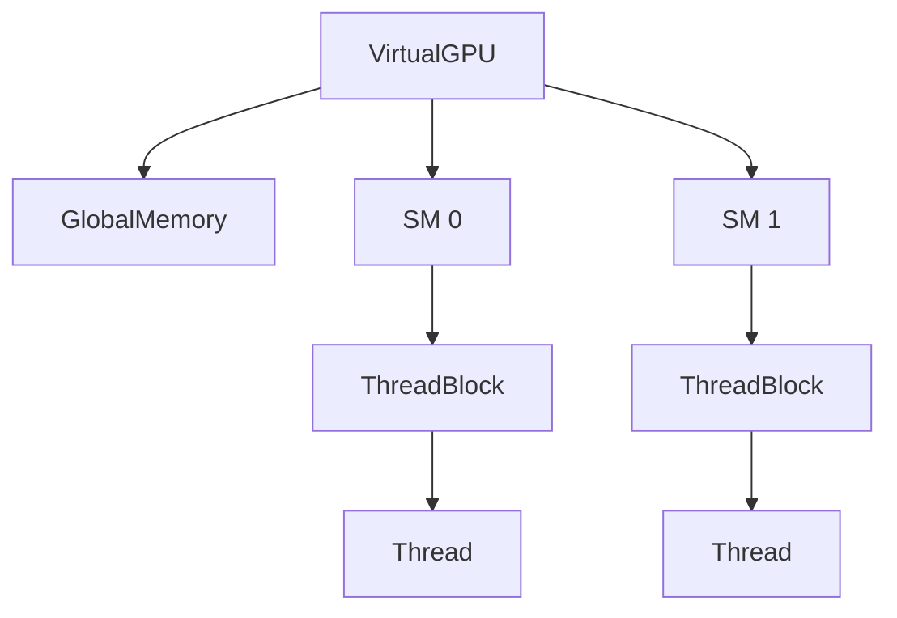

# Py Virtual GPU

Simulador em Python de uma arquitetura de GPU para estudos de paralelismo e programacao de kernels. O projeto reproduz de forma conceitual os principais elementos de uma GPU moderna, permitindo experimentar o modelo SIMT sem hardware dedicado.

## Componentes Principais

- **VirtualGPU** – dispositivo que agrega vários `StreamingMultiprocessor`s e a `GlobalMemory`.
- **StreamingMultiprocessor** – executa `ThreadBlock`s e gerencia `Warp`s.
- **ThreadBlock** – conjunto de threads com `SharedMemory` e barreira de sincronização.
- **Thread/Warp** – threads são agrupadas em warps que executam em *lock-step*.
- **Memórias** – `GlobalMemory` compartilhada por todos os blocks e `SharedMemory` restrita a cada block.

Um resumo detalhado das classes está em [docs/class_structure.md](docs/class_structure.md). Para uma descrição do fluxo de execução consulte [docs/components_and_execution.md](docs/components_and_execution.md).

## Visão Geral da Arquitetura

O `VirtualGPU` distribui blocks para os SMs, que por sua vez instanciam warps e threads para executar o kernel.

